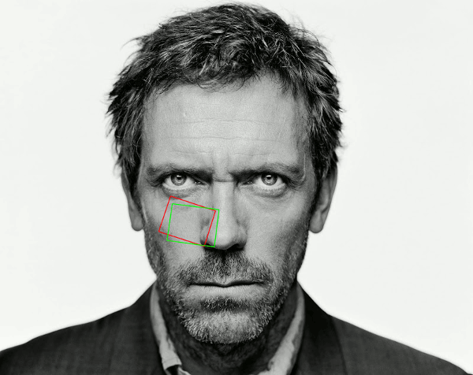

# About this library

**Image Align** is a C++ library providing variants of the classic image alignment algorithm by Lucas-Kanade.



The project emerged while working on [AAM](https://www.github.com/cheind/aam), an active appearance models library. Fitting active appearance models is
similar to the classic image alignment problem: 

> The goal of image alignment is to find the locally 'best' transform between a template image and a target image by minimizing an energy function measuring the fitness of the alignment. -- <cite>Ian Matthews</cite>
 
# Algorithms and Features

All image alignment algorithms implemented in this library are based on the original formulation of [Lucas-Kanade](#Lucas81):

 - Forward additive algorithm
 - Forward compositional algorithm
 - Inverse compositional algorithm

For convergence and runtime reasons all algorithms support **multi-level hierarchical** matching.

The alignment algorithms are independent of the chosen warp function. Currently the library provides the following warp modes:

 - 2D Translational Warp
 - 2D Euclidean Warp 
 - 2D Similarity Warp
 - 2D Affine Warp

User defined warp functions can be easily added. 

# Building from source
**Image Alignment** requires the following pre-requisites

 - [CMake](www.cmake.org) - for generating cross platform build files
 - [OpenCV](www.opencv.org) - for image processing related functions 
 
To build from source

 1. Point CMake to the cloned git repository
 1. Click CMake Configure
 1. Point `OpenCV_DIR` to the directory containing the file `OpenCVConfig.cmake`
 1. Click CMake Generate
 
Although **Image Alignment** should build across multiple platforms and architectures, tests are carried out on these systems
 - Windows 8/10 MSVC10 x86
 - OS X 10.10 XCode 7.x

If the build should fail for a specific platform, don't hesitate to create an issue. 

# References

 1. <a name="Lucas81"></a>Lucas, Bruce D., and Takeo Kanade. "An iterative image registration technique with an application to stereo vision." IJCAI. Vol. 81. 1981.
 2. 

# License
```
This file is part of Image Alignment.

Copyright Christoph Heindl 2015

Image Alignment is free software: you can redistribute it and/or modify
it under the terms of the GNU General Public License as published by
the Free Software Foundation, either version 3 of the License, or
(at your option) any later version.

Image Alignment is distributed in the hope that it will be useful,
but WITHOUT ANY WARRANTY; without even the implied warranty of
MERCHANTABILITY or FITNESS FOR A PARTICULAR PURPOSE.  See the
GNU General Public License for more details.

You should have received a copy of the GNU General Public License
along with Image Alignment.  If not, see <http://www.gnu.org/licenses/>.
```
